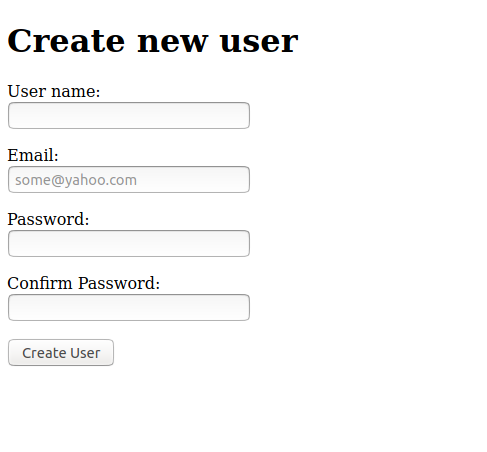
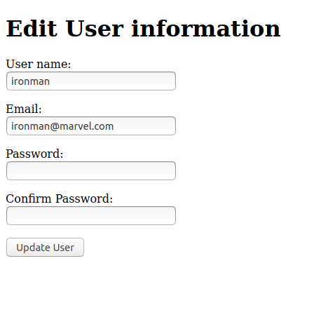

# Re-Former

## Project Description
This project demonstrates form building in Ruby on Rails.

The project contains a user model and two form page templates, one for creating a new user and one for editing an existing user.

It follows the tutorial found at the [odin project](https://www.theodinproject.com/courses/ruby-on-rails/lessons/forms)

### Screenshots of the Forms
|Add a new user|Update existing user|
|-|-|
|||
|||

## Built With

- Ruby 2.7.1
- Ruby on Rails 5.2.4.3

## How to run the Re-former on your local machine

### Prerequisites
1. You should have ruby installed.(This project was tested on version `2.7.1`)
1. You should have rails installed.(This project was tested on version `5.2.4.3`)
  
### Steps to follow
1. Clone the repository to your local machine using `git clone git@github.com:RNtaate/Re-former.git`
1. On your local machine, navigate to the micro reddit folder using `cd Re-former` in your terminal
1. Migrate the database using this command
`bin/rake db:migrate`
1. Start the server by using this command.
`bin/rails server`
#### To create a new user:
- Open this link in your favorite browser `http://localhost:3000/users/new`

#### To edit an existing user:
- Open this link in your favorite browser `http://localhost:3000/users/{user_id}/edit`
> Note: Replace the *{user_id}* with an existing ID number(e.g. 1)

## Contributions

  There are two ways of contributing to this project:

1.  If you see something wrong or not working, please check [the issue tracker section](https://github.com/RNtaate/Re-former/issues), if that problem you met is not in already opened issues then open the issue by clicking on `new issue` button.

2.  If you have a solution to that, and you are willing to work on it, follow the below steps to contribute:
    1.  Fork this repository
    1.  Clone it on your local computer by running `git clone git@github.com:RNtaate/Re-former.git` __Replace *RNtaate* with the username you use on github__
    1.  Open the cloned repository which appears as a folder on your local computer with your favorite code editor
    1.  Create a separate branch off the *master branch*,
    1.  Write your codes which fix the issue you found
    1.  Commit and push the branch you created
    1.  Raise a pull request, comparing your new created branch with our original master branch [here](https://github.com/RNtaate/Re-former)

## Authors

👤 **Roy Ntaate**

- Github: [@RNtaate](https://github.com/RNtaate)
- Twitter: [@RNtaate](https://twitter.com/RNtaate)
- Linkedin: [roy-ntaate](https://linkedin.com/in/roy-ntaate)

👤 **Rayhan**

- Github: [@ershadul1](https://github.com/ershadul1)
- Twitter: [@ErshadulRayhan](https://twitter.com/ErshadulRayhan)
- Linkedin: [ErshadulRayhan](https://www.linkedin.com/in/ershadul-hakim-rayhan-a5a17649/)
- Email:  ershadul.rayhan@gmail.com

## Show your support

Give a ⭐️ if you like this project!

## Acknowledgments
- This project was originally taken from [the Odin project](https://www.theodinproject.com/courses/ruby-on-rails/lessons/forms).
- This project was inspired by the [Microverse](https:www.microverse.org) program